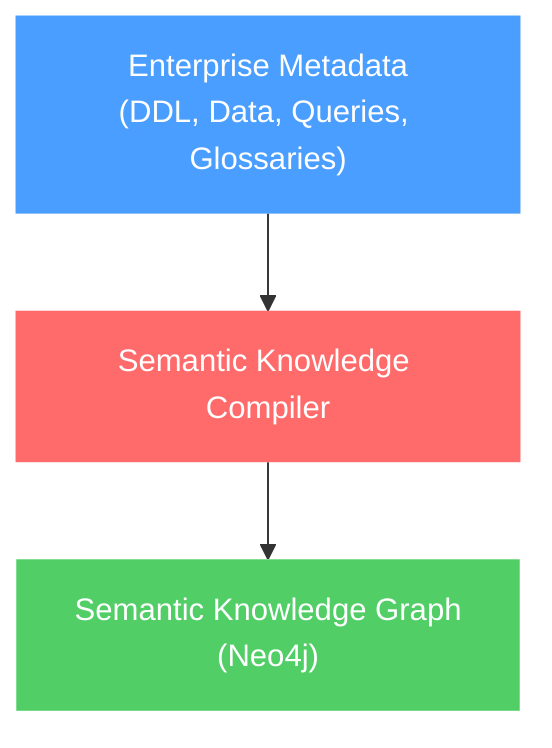
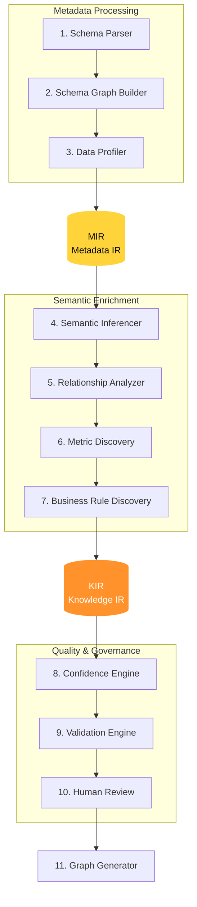
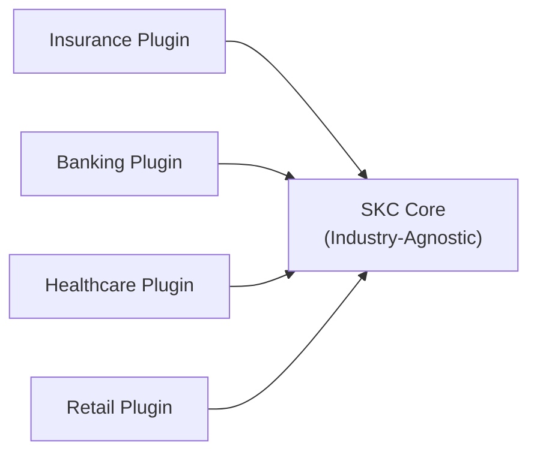

# SKC Architecture

> **Version**: 1.0 · **Status**: Approved

---

## Project Vision

The **Semantic Knowledge Compiler (SKC)** is an offline platform that transforms enterprise database metadata into a governed **Semantic Knowledge Graph** stored in Neo4j.

The graph is consumed by downstream systems — the compiler itself does **not** answer user questions.

### What SKC Is Not

| ❌ Not This | Why |
|---|---|
| Chatbot | SKC produces a graph, not conversational answers |
| Text-to-SQL engine | SKC builds knowledge, not queries |
| GraphRAG system | SKC compiles metadata, not retrieval-augmented content |
| Reporting platform | SKC does not visualise or present data |

---

## Problem Statement

Enterprise databases contain rich structural information but very little explicit business meaning. Business knowledge is scattered across:

- **DDL** — table/column definitions
- **Sample data** — actual values that reveal semantics
- **SQL queries** — usage patterns exposing relationships
- **BI reports** — metric definitions and business logic
- **Business glossaries** — canonical term definitions
- **SME knowledge** — undocumented tribal knowledge

Current LLM-only ontology generation approaches are unreliable because they attempt to infer complete business knowledge from incomplete inputs. SKC solves this by combining **deterministic metadata extraction**, **targeted semantic inference**, **confidence scoring**, and **human governance**.

---

## Core Philosophy

```
Database       → Stores business data
Semantic Graph → Stores business knowledge
Application    → Implements compiler behavior
```

> **Business knowledge must never be hardcoded into application code.**

---

## High-Level Architecture



---

## Compiler Pipeline

The compiler follows a traditional compiler architecture with two intermediate representations.



Every stage has **one responsibility** and communicates through defined IRs.

---

## Intermediate Representations

### MIR — Metadata Intermediate Representation

Contains **only technical metadata** — zero business semantics.

- Database, Schema, Table, Column
- Primary Key, Foreign Key, Index, Constraint
- Data profiles (distinct counts, null ratios, sample values)
- Table topology labels (FACT, DIMENSION, BRIDGE, STANDALONE)

### KIR — Knowledge Intermediate Representation

Contains **semantic business knowledge**.

- Business Entity, Business Concept
- Business Relationship (with join paths)
- Metric (with formulas)
- Business Rule
- Time Intelligence, Security Metadata
- Synonyms, Grain Definitions

Every KIR node extends `CandidateKnowledge` — carrying provenance, confidence, and review status.

---

## LLM Philosophy

LLMs are used **only for narrowly scoped semantic reasoning**:

| ✅ Allowed | ❌ Forbidden |
|---|---|
| Identify a business entity | Build the complete ontology |
| Suggest synonyms | Write directly to Neo4j |
| Describe a table | Bypass human review |
| Infer a likely business concept | Invent unsupported business rules |
| Suggest a metric formula | Make cross-cutting architectural decisions |

**Deterministic extraction always runs before AI inference.** LLMs fill gaps — they do not drive the pipeline.

---

## Human-in-the-Loop

All inferred knowledge becomes **Candidate Knowledge**. Each candidate carries:

| Attribute | Purpose |
|---|---|
| **Confidence** | Weighted score from multiple signals (0.0–1.0) |
| **Provenance** | Source: deterministic, LLM, plugin, human, glossary |
| **Evidence** | The signals and data that support the inference |
| **Review Status** | PENDING, APPROVED, REJECTED, MODIFIED, AUTO_APPROVED |
| **Version** | Build version for tracking evolution |

### Confidence Tiers

| Tier | Score | Action |
|---|---|---|
| HIGH | ≥ 0.85 | Auto-approved (configurable) |
| MEDIUM | 0.60 – 0.84 | Flagged for optional review |
| LOW | < 0.60 | **Mandatory** human review |

---

## Plugin Architecture

The compiler core is **industry-agnostic**. Domain-specific knowledge is delivered through **plugins**.



Plugins contribute:
- **Ontology** — seed business entities
- **Metrics** — domain-standard KPIs
- **Rules** — domain business rules
- **Synonyms** — industry terminology
- **Validators** — domain-specific validation functions

---

## Engineering Principles

1. Business knowledge belongs in Neo4j
2. Compiler behavior belongs in code
3. Deterministic extraction before AI inference
4. Every stage communicates through defined IRs
5. Every inference is traceable
6. Every inference has confidence
7. Every inference is reviewable
8. Every build is versioned
9. Components remain independently testable
10. Plugin architecture is mandatory

---

## Technology Stack

| Layer | Technology | Purpose |
|---|---|---|
| Language | Python 3.12+ | Core runtime |
| IR Schemas | Pydantic v2 | Typed, validated, serialisable models |
| DB Connectors | SQLAlchemy 2.0 | Dialect-agnostic metadata extraction |
| Graph Store | Neo4j 5.x | Semantic Knowledge Graph |
| LLM Integration | LiteLLM | Provider-agnostic LLM access |
| CLI | Typer | Command-line interface |
| Config | Dynaconf | Layered YAML + env config |
| Logging | structlog | Structured JSON logging |
| Serialisation | JSON Lines (.jsonl) | Streamable IR artefacts |
| Testing | pytest + Testcontainers | Unit + integration testing |
| Packaging | uv + pyproject.toml | Modern Python packaging |
