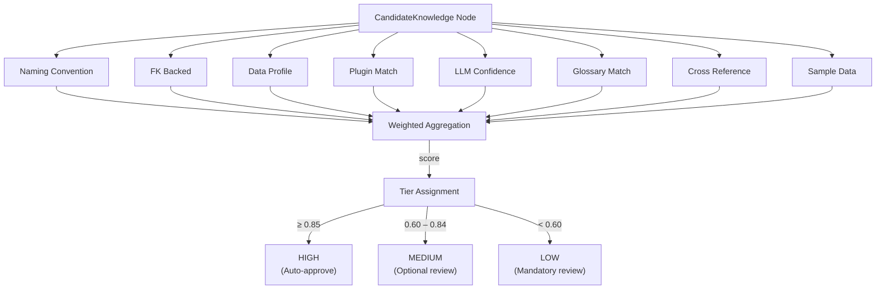

# Confidence Scoring Model

> **Version**: 1.0 · **Module**: `skc.confidence`

---

## Purpose

Every inferred knowledge item in the KIR receives a **confidence score** — a weighted aggregate of multiple independent signals that measure how reliable the inference is. The score determines whether the knowledge is auto-approved, flagged for review, or requires mandatory human verification.

---

## Signal Catalogue

| # | Signal | Weight | Value Range | Description | Applicable To |
|---|---|---|---|---|---|
| 1 | `naming_convention_match` | 0.15 | 0.0 or 1.0 | Entity/column name matches known patterns (`_id`, `_date`, `_amount`, etc.) | All |
| 2 | `fk_backed` | 0.20 | 0.0 or 1.0 | Relationship is backed by a foreign key constraint | BusinessRelationship |
| 3 | `data_profile_support` | 0.15 | 0.0 – 1.0 | Data profiling corroborates the inference | All |
| 4 | `plugin_match` | 0.15 | 0.0 or 1.0 | A domain plugin provides corroborating evidence | All |
| 5 | `llm_confidence` | 0.10 | 0.0 – 0.8 | LLM's self-reported confidence (calibrated) | LLM-inferred |
| 6 | `glossary_match` | 0.10 | 0.0 or 1.0 | Term appears in a business glossary | BusinessEntity, BusinessConcept |
| 7 | `cross_reference_count` | 0.10 | 0.0 – 1.0 | Number of independent signals that agree | All |
| 8 | `sample_data_support` | 0.05 | 0.0 – 1.0 | Sample values are consistent with the inference | All |

**Total weight**: 1.00

---

## Scoring Formula

The confidence score is computed as a **weighted sum** of applicable signals:

$$\text{score} = \frac{\sum_{i \in \text{applicable}} w_i \cdot v_i}{\sum_{i \in \text{applicable}} w_i}$$

Where:
- $w_i$ = weight of signal $i$
- $v_i$ = value of signal $i$ (0.0 – 1.0)
- Only signals that are **applicable** to the candidate are included

The normalisation by applicable weights ensures that candidates where some signals don't apply (e.g., `fk_backed` for a Metric) are not penalised.

---

## Confidence Tiers

| Tier | Score Range | Action | Rationale |
|---|---|---|---|
| **HIGH** | ≥ 0.85 | Auto-approved (configurable) | Strong multi-signal agreement |
| **MEDIUM** | 0.60 – 0.84 | Flagged for optional review | Moderate confidence, review recommended |
| **LOW** | < 0.60 | **Mandatory** human review | Insufficient evidence to trust |

---

## Signal Evaluation Flow



---

## Signal Details

### 1. Naming Convention Match

Checks if the candidate's associated names match known database naming patterns:

| Pattern | Indicates |
|---|---|
| `*_id`, `*_key` | Identifier / dimension |
| `*_date`, `*_at`, `*_time` | Temporal column |
| `*_amount`, `*_total`, `*_price` | Financial measure |
| `*_count`, `*_qty`, `*_quantity` | Count measure |
| `*_status`, `*_state` | Status classification |
| `*_type`, `*_code`, `*_category` | Type classification |
| `*_flag`, `*_is_*` | Boolean indicator |
| `*_name`, `*_description` | Descriptive text |

**Returns**: 1.0 if ≥1 pattern matches, 0.0 otherwise.

### 2. Foreign Key Backed

Only applicable to `BusinessRelationship` candidates.

**Returns**: 1.0 if any `JoinPath` has `is_deterministic=True`, 0.0 otherwise.

### 3. Data Profile Support

Examines profiling data for corroboration:
- Entity: distinct count of grain columns matches expected cardinality
- Concept: value distribution matches category (e.g., low cardinality → CLASSIFICATION)
- Metric: numeric column with non-null values

**Returns**: 0.0 – 1.0 proportional to how well profiles support the inference.

### 4. Plugin Match

Checks if a registered domain plugin independently identifies the same entity, metric, or rule.

**Returns**: 1.0 if plugin agrees, 0.0 if no plugin match.

### 5. LLM Confidence

Extracts the LLM's self-reported confidence from its response and applies **calibration**:

$$\text{calibrated} = \text{raw\_confidence} \times 0.8$$

The 0.8 multiplier accounts for the known tendency of LLMs to be overconfident.

**Returns**: Calibrated value (0.0 – 0.8 range).

### 6. Glossary Match

Checks if the candidate's name or synonyms appear in a provided business glossary.

**Returns**: 1.0 if found, 0.0 if not.

### 7. Cross Reference Count

Counts the number of independent signals (from other evaluators) that produced a positive value for this candidate:

$$\text{value} = \min\left(\frac{\text{positive\_signals}}{3}, 1.0\right)$$

This rewards candidates with multiple corroborating evidence sources.

### 8. Sample Data Support

Checks if sample values in the data profile are consistent with the inferred semantics:
- Email patterns for a "customer_email" entity
- Date patterns for a TimeIntelligence candidate
- Numeric ranges for a Metric

**Returns**: 0.0 – 1.0 based on consistency.

---

## Configuration

Signal weights and thresholds are configurable in `configs/default.yaml`:

```yaml
confidence:
  auto_approve_threshold: 0.85
  mandatory_review_threshold: 0.60
  signal_weights:
    naming_convention_match: 0.15
    fk_backed: 0.20
    data_profile_support: 0.15
    plugin_match: 0.15
    llm_confidence: 0.10
    glossary_match: 0.10
    cross_reference_count: 0.10
    sample_data_support: 0.05
```

Override any weight by changing the value. The system normalises to the sum of applicable weights.

---

## Worked Example

**Candidate**: `BusinessEntity(name="Customer", entity_type=CORE)`

| Signal | Weight | Value | Reasoning |
|---|---|---|---|
| naming_convention_match | 0.15 | 1.0 | "Customer" matches entity pattern |
| fk_backed | 0.20 | N/A | Not a relationship |
| data_profile_support | 0.15 | 0.8 | customers table has high distinct count on PK |
| plugin_match | 0.15 | 1.0 | Insurance plugin defines "Insured" synonym |
| llm_confidence | 0.10 | 0.72 | LLM reported 0.90 × 0.8 = 0.72 |
| glossary_match | 0.10 | 1.0 | "Customer" in business glossary |
| cross_reference_count | 0.10 | 1.0 | 4 positive signals → min(4/3, 1.0) = 1.0 |
| sample_data_support | 0.05 | 0.6 | Sample names look like person names |

**Applicable weights**: 0.15 + 0.15 + 0.15 + 0.10 + 0.10 + 0.10 + 0.05 = **0.80** (fk_backed excluded)

**Score**: (0.15×1.0 + 0.15×0.8 + 0.15×1.0 + 0.10×0.72 + 0.10×1.0 + 0.10×1.0 + 0.05×0.6) / 0.80

= (0.15 + 0.12 + 0.15 + 0.072 + 0.10 + 0.10 + 0.03) / 0.80

= 0.722 / 0.80 = **0.903**

**Tier**: HIGH (≥ 0.85) → **Auto-approved** ✅

---

## Future: Learning Feedback Loop

As human reviewers approve, reject, or modify candidates, `LearningMetadata` records are created. Over time, these records can be used to:

1. **Recalibrate signal weights** — signals that frequently agree with human reviewers get higher weight
2. **Adjust LLM calibration** — compare LLM confidence against actual approval rates
3. **Improve pattern detection** — learn which naming patterns are reliable in this specific organisation
4. **Train domain classifiers** — use approved knowledge as training data for future builds

This creates a **flywheel effect** — each build improves the accuracy of subsequent builds.
