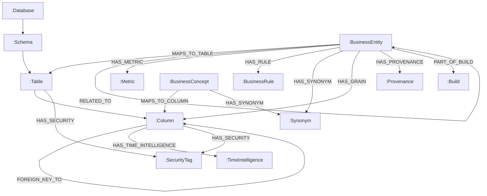

# Neo4j Graph Schema Reference

> **Version**: 1.0 · **Module**: `skc.graph.schema`

---

## Overview

The Semantic Knowledge Graph in Neo4j represents both the **structural metadata** (databases, schemas, tables, columns) and the **semantic knowledge** (business entities, concepts, metrics, rules, relationships) compiled by SKC. Every semantic node carries provenance and is linked to a build version.

---

## Node Labels

### Structural Nodes

#### `:Database`

| Property | Type | Required | Description |
|---|---|---|---|
| `name` | String | ✅ | Database name |
| `dialect` | String | ✅ | Database dialect (POSTGRES, MYSQL, etc.) |

**Unique constraint**: `name`

#### `:Schema`

| Property | Type | Required | Description |
|---|---|---|---|
| `name` | String | ✅ | Schema name |

**Index**: `name`

#### `:Table`

| Property | Type | Required | Description |
|---|---|---|---|
| `name` | String | ✅ | Table name |
| `table_type` | String | ✅ | TABLE, VIEW, MATERIALIZED_VIEW, EXTERNAL |
| `row_count` | Integer | | Approximate row count |
| `topology` | String | | FACT, DIMENSION, BRIDGE, STANDALONE |

**Index**: `name`

#### `:Column`

| Property | Type | Required | Description |
|---|---|---|---|
| `name` | String | ✅ | Column name |
| `data_type` | String | ✅ | Raw database type |
| `normalized_type` | String | ✅ | Normalised type enum |
| `is_nullable` | Boolean | ✅ | Nullable flag |

**Index**: `name`

---

### Semantic Nodes

#### `:BusinessEntity`

| Property | Type | Required | Description |
|---|---|---|---|
| `id` | String | ✅ | UUID |
| `name` | String | ✅ | Entity name |
| `description` | String | ✅ | Business description |
| `entity_type` | String | ✅ | CORE, REFERENCE, TRANSACTIONAL, BRIDGE, AGGREGATE |
| `confidence_score` | Float | ✅ | 0.0–1.0 |
| `review_status` | String | ✅ | PENDING, APPROVED, REJECTED, etc. |
| `build_version` | String | ✅ | Build that created this node |

**Unique constraint**: `id` · **Index**: `name`

#### `:BusinessConcept`

| Property | Type | Required | Description |
|---|---|---|---|
| `id` | String | ✅ | UUID |
| `name` | String | ✅ | Concept name |
| `description` | String | ✅ | Business description |
| `category` | String | ✅ | MEASURE, DIMENSION, etc. |
| `confidence_score` | Float | ✅ | 0.0–1.0 |
| `review_status` | String | ✅ | Review state |
| `build_version` | String | ✅ | Build version |

**Unique constraint**: `id` · **Index**: `name`

#### `:Metric`

| Property | Type | Required | Description |
|---|---|---|---|
| `id` | String | ✅ | UUID |
| `name` | String | ✅ | Metric name |
| `description` | String | ✅ | Business description |
| `formula` | String | ✅ | SQL expression |
| `formula_type` | String | ✅ | AGGREGATE, RATIO, etc. |
| `unit` | String | | Unit of measure |
| `confidence_score` | Float | ✅ | 0.0–1.0 |
| `review_status` | String | ✅ | Review state |
| `build_version` | String | ✅ | Build version |

**Unique constraint**: `id` · **Index**: `name`

#### `:BusinessRule`

| Property | Type | Required | Description |
|---|---|---|---|
| `id` | String | ✅ | UUID |
| `name` | String | ✅ | Rule name |
| `description` | String | ✅ | Business description |
| `rule_type` | String | ✅ | CONSTRAINT, DERIVATION, etc. |
| `expression` | String | ✅ | Logical expression |
| `confidence_score` | Float | ✅ | 0.0–1.0 |
| `review_status` | String | ✅ | Review state |
| `build_version` | String | ✅ | Build version |

**Unique constraint**: `id`

#### `:Synonym`

| Property | Type | Required | Description |
|---|---|---|---|
| `term` | String | ✅ | Synonym term |
| `language` | String | ✅ | Language code |

#### `:TimeIntelligence`

| Property | Type | Required | Description |
|---|---|---|---|
| `id` | String | ✅ | UUID |
| `column_ref` | String | ✅ | Column reference |
| `time_role` | String | ✅ | EVENT_TIME, CREATED_AT, etc. |
| `granularity` | String | ✅ | DAY, MONTH, etc. |
| `timezone` | String | | Timezone |

**Unique constraint**: `id`

#### `:SecurityTag`

| Property | Type | Required | Description |
|---|---|---|---|
| `id` | String | ✅ | UUID |
| `scope` | String | ✅ | Table or column ref |
| `classification` | String | ✅ | PUBLIC, PII, PHI, etc. |

**Unique constraint**: `id`

---

### Metadata Nodes

#### `:Provenance`

| Property | Type | Required | Description |
|---|---|---|---|
| `source_type` | String | ✅ | DETERMINISTIC, LLM_INFERRED, PLUGIN, HUMAN, GLOSSARY |
| `source_id` | String | ✅ | Source identifier |
| `source_detail` | String | | Additional detail |
| `timestamp` | DateTime | ✅ | When inference was made |
| `build_version` | String | ✅ | Build version |

#### `:Build`

| Property | Type | Required | Description |
|---|---|---|---|
| `build_id` | String | ✅ | UUID |
| `build_version` | String | ✅ | Semantic version |
| `started_at` | DateTime | ✅ | Build start time |
| `completed_at` | DateTime | | Build end time |
| `status` | String | ✅ | SUCCESS, FAILED, etc. |

**Unique constraint**: `build_id`

---

## Relationship Types

| Relationship | From | To | Properties | Description |
|---|---|---|---|---|
| `CONTAINS_SCHEMA` | Database | Schema | | Database contains schema |
| `CONTAINS_TABLE` | Schema | Table | | Schema contains table |
| `HAS_COLUMN` | Table | Column | | Table has column |
| `FOREIGN_KEY_TO` | Column | Column | `fk_name` | FK reference |
| `MAPS_TO_TABLE` | BusinessEntity | Table | `confidence` | Entity→table mapping |
| `MAPS_TO_COLUMN` | BusinessConcept | Column | `confidence` | Concept→column mapping |
| `RELATED_TO` | BusinessEntity | BusinessEntity | `relationship_type`, `cardinality`, `description` | Entity relationship |
| `HAS_METRIC` | BusinessEntity | Metric | | Entity has metric |
| `HAS_RULE` | BusinessEntity | BusinessRule | | Entity has rule |
| `HAS_SYNONYM` | BusinessEntity/Concept | Synonym | | Has alternative name |
| `HAS_TIME_INTELLIGENCE` | Column | TimeIntelligence | | Temporal metadata |
| `HAS_SECURITY` | Table/Column | SecurityTag | | Security classification |
| `HAS_PROVENANCE` | Any | Provenance | | Source attribution |
| `HAS_GRAIN` | BusinessEntity | Column | `grain_role` | Grain definition |
| `SUPERSEDES` | Any versioned | Previous version | | Version chain |
| `PART_OF_BUILD` | Any | Build | | Build membership |

---

## Graph Topology



---

## Versioning & Incremental Updates

### Build Versioning
Every node receives a `build_version` property. A `:Build` node is created for each compilation run, and all nodes written during that build are connected via `PART_OF_BUILD`.

### Incremental Recompilation
- **MERGE semantics**: The graph writer uses `MERGE` instead of `CREATE` for idempotency
- **SUPERSEDES**: Updated nodes link to their previous version via `SUPERSEDES` relationships
- **Soft deletes**: Nodes removed from KIR are marked `deprecated=true` rather than deleted
- **Hash comparison**: Content hashes (SHA-256 of canonical JSON) detect unchanged nodes to skip

---

## Example Cypher Queries

### Get a business entity subgraph
```cypher
MATCH (e:BusinessEntity {name: "Customer"})
OPTIONAL MATCH (e)-[:MAPS_TO_TABLE]->(t:Table)-[:HAS_COLUMN]->(c:Column)
OPTIONAL MATCH (e)-[r:RELATED_TO]->(e2:BusinessEntity)
OPTIONAL MATCH (e)-[:HAS_METRIC]->(m:Metric)
OPTIONAL MATCH (e)-[:HAS_SYNONYM]->(s:Synonym)
RETURN e, t, c, r, e2, m, s
```

### Find all metrics
```cypher
MATCH (m:Metric)
WHERE m.review_status = 'APPROVED'
RETURN m.name, m.formula, m.formula_type, m.confidence_score
ORDER BY m.name
```

### Traverse entity relationships
```cypher
MATCH path = (e1:BusinessEntity)-[:RELATED_TO*1..3]->(e2:BusinessEntity)
WHERE e1.name = "Customer"
RETURN path
```

### Find PII columns
```cypher
MATCH (c:Column)-[:HAS_SECURITY]->(s:SecurityTag)
WHERE s.classification IN ['PII', 'PHI', 'PCI']
RETURN c.name, s.classification, s.scope
```

### Get build history
```cypher
MATCH (b:Build)
RETURN b.build_id, b.build_version, b.started_at, b.status
ORDER BY b.started_at DESC
LIMIT 10
```
