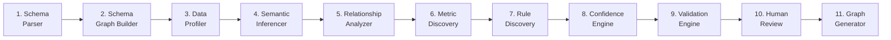

# Pipeline Stages Specification

> **Version**: 1.0 · **Module**: `skc.stages`

---

## Overview

The SKC compiler pipeline consists of **11 stages**, each with a single responsibility. Stages communicate exclusively through the `CompilationContext` — a mutable state object carrying the MIR, KIR, artefacts, and build metadata.



---

## Pipeline Stage Contract

Every stage implements `PipelineStage` (ABC):

```python
class PipelineStage(ABC):
    name: str                # "schema_parser"
    version: str             # "0.1.0"
    description: str         # Human-readable
    requires: list[str]      # Stages that must run first
    produces: list[str]      # Artefact names written

    async def run(ctx: CompilationContext) -> StageResult
    async def validate_inputs(ctx: CompilationContext) -> list[str]
```

### CompilationContext

| Field | Type | Description |
|---|---|---|
| `build_id` | `str` | UUID for this build |
| `build_version` | `str` | Semantic version |
| `config` | `dict` | Loaded configuration |
| `output_dir` | `Path` | Artefact output directory |
| `mir` | `MIRDatabase \| None` | Populated by Stage 1 |
| `profiles` | `MIRProfileSet \| None` | Populated by Stage 3 |
| `kir` | `KnowledgeGraph` | Populated by Stages 4–7 |
| `stage_results` | `dict[str, StageResult]` | Execution records |
| `previous_build` | `CompilationContext \| None` | For incremental builds |

### StageResult

| Field | Type | Description |
|---|---|---|
| `stage_name` | `str` | Stage identifier |
| `status` | `StageStatus` | SUCCESS, WARNING, ERROR, SKIPPED |
| `started_at` | `datetime` | Start timestamp |
| `completed_at` | `datetime` | End timestamp |
| `duration_ms` | `int` | Execution duration |
| `artefacts_written` | `list[str]` | Output artefact names |
| `warnings` | `list[str]` | Non-fatal messages |
| `errors` | `list[str]` | Fatal messages |
| `stats` | `dict[str, Any]` | Stage-specific metrics |

---

## Stage 1 — Schema Parser

**Module**: `s01_schema_parser.py`
**Requires**: None
**Produces**: `mir_database`

Extracts structural metadata from the source database using the configured connector (PostgreSQL, MySQL, Snowflake, BigQuery, or DDL file).

- Instantiates the appropriate `MetadataConnector`
- Calls `connector.extract_metadata()` → `MIRDatabase`
- Writes MIR to `{output_dir}/mir/database.jsonl`

**Stats**: `tables_parsed`, `columns_parsed`, `fks_found`, `schemas_found`

---

## Stage 2 — Schema Graph Builder

**Module**: `s02_schema_graph_builder.py`
**Requires**: `schema_parser`
**Produces**: `mir_topology`

Builds an in-memory table relationship graph from FK edges and classifies tables.

- **Connected components** — clusters of related tables
- **Hub tables** — many inbound FKs → likely DIMENSION
- **Bridge tables** — only FK columns → likely many-to-many BRIDGE
- **Orphan tables** — no FK relationships → STANDALONE
- **Topology classification** — FACT, DIMENSION, BRIDGE, STANDALONE

**Stats**: `components_found`, `fact_tables`, `dimension_tables`, `bridge_tables`, `standalone_tables`

---

## Stage 3 — Data Profiler

**Module**: `s03_data_profiler.py`
**Requires**: `schema_parser`
**Produces**: `mir_profiles`

Column-level statistical profiling against a live database connection.

For each column:
- Distinct count, null count, null ratio
- Min/max values, mean (numeric columns)
- Sample values (up to 10)
- Value distribution (top-N frequencies)
- Pattern detection (email, UUID, phone, URL, boolean-like, enum-like, date-as-string)

**Sampling**: First N rows (configurable, default 100k).
**Skippable**: If no live DB connection, stage is skipped with a warning.

**Stats**: `columns_profiled`, `patterns_detected`, `sample_size`

---

## Stage 4 — Semantic Inferencer

**Module**: `s04_semantic_inferencer.py`
**Requires**: `schema_parser`, `schema_graph_builder`
**Produces**: `kir_entities`, `kir_concepts`, `kir_synonyms`, `kir_time`, `kir_security`

The largest stage. Transforms MIR into initial KIR via 6 sub-steps:

### 4.1 Entity Identification
- **Deterministic**: Tables labelled FACT/DIMENSION → candidate entities
- **LLM**: For each table cluster, identify business entities

### 4.2 Business Concept Identification
- **Deterministic**: Name patterns → MEASURE (`*_amount`), DIMENSION (`*_id`), CLASSIFICATION (`*_status`)
- **LLM**: Classify ambiguous columns

### 4.3 Synonym Generation
- **LLM**: Generate business synonyms for entities/concepts
- **Plugin**: Merge plugin-provided synonyms

### 4.4 Description Generation
- **LLM**: Generate human-readable business descriptions for entities and concepts

### 4.5 Time Intelligence Detection
- **Deterministic**: `created_at`, `updated_at`, `effective_date` → time roles
- **LLM**: Classify ambiguous date columns

### 4.6 Security Classification
- **Deterministic**: Pattern-based PII detection (email, phone, SSN in samples)
- **Plugin**: Domain-specific sensitive columns

---

## Stage 5 — Relationship Analyzer

**Module**: `s05_relationship_analyzer.py`
**Requires**: `semantic_inferencer`
**Produces**: `kir_relationships`, `kir_grain`

### 5.1 Deterministic Relationship Extraction
- Every FK → `BusinessRelationship` with `is_deterministic=True`
- Cardinality: 1:1 if FK is unique, 1:N otherwise

### 5.2 Inferred Relationship Discovery
- Naming convention: `orders.customer_id` → references `customers.id`
- Data profile correlation: column value subsets
- LLM: ambiguous cases

### 5.3 Join Path Construction
- Concrete `JoinPath` for each relationship
- Multi-hop detection (orders → order_items → products)

### 5.4 Grain Analysis
- **Deterministic**: PK columns define entity grain
- **Inferred**: Composite unique constraints, LLM-assisted

---

## Stage 6 — Metric Discovery

**Module**: `s06_metric_discovery.py`
**Requires**: `semantic_inferencer`, `relationship_analyzer`
**Produces**: `kir_metrics`

### 6.1 Deterministic Detection
- Numeric columns: `*_amount`, `*_total`, `*_count`, `*_price`, `*_rate`, `*_balance`
- Standard aggregations: SUM, AVG, COUNT, MIN, MAX

### 6.2 Plugin Injection
- Domain plugins contribute pre-defined metrics

### 6.3 LLM Inference
- Suggest metrics for unmatched numeric columns

### 6.4 Derived Metrics
- Ratios: two numeric columns → ratio metric
- Temporal: numeric + date → time-series metric

---

## Stage 7 — Business Rule Discovery

**Module**: `s07_rule_discovery.py`
**Requires**: `semantic_inferencer`
**Produces**: `kir_rules`

### 7.1 Deterministic Extraction
- CHECK constraints → CONSTRAINT rules
- NOT NULL → VALIDATION rules
- UNIQUE → VALIDATION rules
- DEFAULT values → DERIVATION rules

### 7.2 Profile-Derived Rules
- null_ratio = 0 without NOT NULL → inferred non-null rule
- N distinct values → enum classification rule
- min ≥ 0 → non-negative rule

### 7.3 Plugin Injection
- Domain plugins contribute standard rules

### 7.4 LLM Inference
- Suggest rules for complex business logic

---

## Stage 8 — Confidence Engine

**Module**: `s08_confidence_engine.py`
**Requires**: `metric_discovery`, `rule_discovery`
**Produces**: `kir_scored`

Iterates all KIR nodes and computes confidence scores using 8 weighted signals:

| Signal | Weight | Description |
|---|---|---|
| naming_convention_match | 0.15 | Names match known patterns |
| fk_backed | 0.20 | Relationship backed by FK |
| data_profile_support | 0.15 | Profiling data corroborates |
| plugin_match | 0.15 | Domain plugin agrees |
| llm_confidence | 0.10 | LLM self-reported confidence |
| glossary_match | 0.10 | Term in business glossary |
| cross_reference_count | 0.10 | Corroborating signals count |
| sample_data_support | 0.05 | Sample values consistent |

Assigns confidence tier: HIGH (≥0.85), MEDIUM (≥0.60), LOW (<0.60).

---

## Stage 9 — Validation Engine

**Module**: `s09_validation_engine.py`
**Requires**: `confidence_engine`
**Produces**: `validation_report`

Four validation categories:

1. **Structural** — entity→table mappings exist, relationship IDs valid, column refs valid
2. **Semantic** — no duplicate entities, no circular relationships, formulas parse
3. **Plugin** — run each plugin's custom validators
4. **Cross-reference** — synonym conflicts, grain consistency

Output: `ValidationReport` with blocking errors and non-blocking warnings.

---

## Stage 10 — Human Review

**Module**: `s10_human_review.py`
**Requires**: `validation_engine`
**Produces**: `kir_reviewed`

Filters KIR nodes by confidence tier and manages review workflow:

| Tier | Action |
|---|---|
| HIGH (≥0.85) | Auto-approve (configurable) |
| MEDIUM (0.60–0.84) | Queue for optional review |
| LOW (<0.60) | Queue for mandatory review |

**Modes**: `batch` (auto-approve only), `cli` (interactive Rich terminal), `api` (FastAPI web UI).

---

## Stage 11 — Graph Generator

**Module**: `s11_graph_generator.py`
**Requires**: `human_review`
**Produces**: `neo4j_graph`

Writes approved KIR nodes to Neo4j:

- Only writes nodes with `review_status ∈ {APPROVED, AUTO_APPROVED}`
- Uses MERGE (idempotent) — safe for re-runs
- Batch Cypher operations (UNWIND) for performance
- Every node gets `build_version` property
- Writes `:Build` manifest node
- Supports incremental mode (hash-compare, SUPERSEDES relationships)

**Stats**: `nodes_written`, `relationships_written`, `nodes_skipped`
