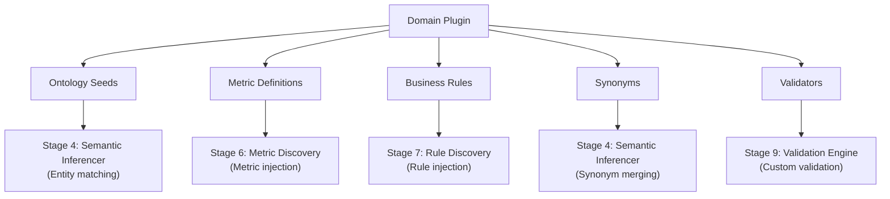

# Plugin Authoring Guide

> **Version**: 1.0

---

## Philosophy

The SKC compiler core is **industry-agnostic**. All domain-specific knowledge is delivered through **plugins**. The compiler core never contains domain-specific logic.

Plugins contribute:
- **Ontology** — seed business entities for the domain
- **Metrics** — standard KPIs and measures
- **Rules** — domain business rules and constraints
- **Synonyms** — industry terminology mappings
- **Validators** — domain-specific validation functions

---

## Plugin Directory Structure

```
plugins/
└── insurance/
    ├── plugin.yaml          # Plugin manifest (required)
    ├── ontology.yaml        # Seed business entities
    ├── metrics.yaml         # Domain metrics
    ├── rules.yaml           # Business rules
    └── synonyms.yaml        # Terminology mappings
```

---

## Plugin Manifest — `plugin.yaml`

```yaml
name: insurance
version: "1.0.0"
description: "Insurance domain knowledge plugin for SKC"
industries:
  - insurance
  - reinsurance
author: "SKC Team"
min_skc_version: "0.1.0"
```

| Field | Type | Required | Description |
|---|---|---|---|
| `name` | `str` | ✅ | Unique plugin identifier |
| `version` | `str` | ✅ | Semantic version |
| `description` | `str` | ✅ | Human-readable description |
| `industries` | `list[str]` | ✅ | Industry tags |
| `author` | `str` | | Plugin author |
| `min_skc_version` | `str` | | Minimum SKC version required |

---

## SKCPlugin Interface

All plugins extend the `SKCPlugin` abstract base class:

```python
from skc.plugins.base import SKCPlugin
from skc.ir.kir import BusinessEntity, Metric, BusinessRule

class InsurancePlugin(SKCPlugin):
    name = "insurance"
    version = "1.0.0"
    description = "Insurance domain knowledge"
    industries = ["insurance", "reinsurance"]

    def get_ontology(self) -> list[BusinessEntity]: ...
    def get_metrics(self) -> list[Metric]: ...
    def get_rules(self) -> list[BusinessRule]: ...
    def get_synonyms(self) -> dict[str, list[str]]: ...
    def get_validators(self) -> list[callable]: ...
```

### Helper Methods

| Method | Purpose |
|---|---|
| `_make_provenance()` | Create a `Provenance` attributed to this plugin |
| `_make_confidence(score=0.75)` | Create a `Confidence` with a plugin_provided signal |

---

## Data File Formats

### ontology.yaml

```yaml
entities:
  - name: Policy
    description: "An insurance policy representing a contract between insurer and insured"
    entity_type: CORE
    synonyms: [contract, coverage, policy_record]

  - name: Claim
    description: "A claim filed against an insurance policy"
    entity_type: TRANSACTIONAL
    synonyms: [loss, claim_record, incident]

  - name: Premium
    description: "Premium payment associated with a policy"
    entity_type: TRANSACTIONAL
    synonyms: [payment, premium_payment]

  - name: Coverage
    description: "Coverage details specifying what is insured under a policy"
    entity_type: REFERENCE
    synonyms: [coverage_type, protection]

  - name: Insured
    description: "The person or entity covered by a policy"
    entity_type: CORE
    synonyms: [policyholder, insured_party, customer]

  - name: Agent
    description: "Insurance agent or broker who sells and manages policies"
    entity_type: REFERENCE
    synonyms: [broker, producer, intermediary]

  - name: Beneficiary
    description: "Person or entity designated to receive policy benefits"
    entity_type: REFERENCE
    synonyms: [payee, recipient]
```

### metrics.yaml

```yaml
metrics:
  - name: Loss Ratio
    description: "Ratio of incurred losses to earned premiums"
    formula: "SUM(claim_amount) / SUM(earned_premium)"
    formula_type: RATIO
    unit: percentage

  - name: Combined Ratio
    description: "Sum of loss ratio and expense ratio"
    formula: "(SUM(claim_amount) + SUM(expenses)) / SUM(earned_premium)"
    formula_type: RATIO
    unit: percentage

  - name: Claim Frequency
    description: "Number of claims per policy in force"
    formula: "COUNT(claims) / COUNT(DISTINCT policies_in_force)"
    formula_type: RATIO
    unit: ratio

  - name: Claim Severity
    description: "Average cost per claim"
    formula: "SUM(claim_amount) / COUNT(claims)"
    formula_type: AGGREGATE
    unit: USD
```

### rules.yaml

```yaml
rules:
  - name: Premium Positive
    description: "Premium amount must be greater than zero"
    rule_type: CONSTRAINT
    expression: "premium_amount > 0"

  - name: Claim Within Coverage
    description: "Claim amount must not exceed coverage limit"
    rule_type: CONSTRAINT
    expression: "claim_amount <= coverage_limit"

  - name: Policy Must Have Insured
    description: "Every policy must be linked to an insured party"
    rule_type: VALIDATION
    expression: "policy.insured_id IS NOT NULL"

  - name: Effective Date Before Expiry
    description: "Policy effective date must precede expiry date"
    rule_type: TEMPORAL
    expression: "effective_date < expiry_date"
```

### synonyms.yaml

```yaml
synonyms:
  policy: [contract, coverage_agreement, policy_record]
  claim: [loss, claim_record, incident, loss_event]
  premium: [payment, premium_payment, premium_amount]
  insured: [policyholder, insured_party, customer, client]
  agent: [broker, producer, intermediary, sales_agent]
  beneficiary: [payee, recipient, designated_beneficiary]
  deductible: [excess, self_insured_retention]
  underwriting: [risk_assessment, risk_evaluation]
```

---

## How Plugins Feed the Pipeline



### Pipeline Integration Points

| Plugin Contribution | Pipeline Stage | How It's Used |
|---|---|---|
| Ontology entities | Stage 4 (Semantic Inferencer) | Matched against MIR tables; matched entities get higher confidence |
| Metrics | Stage 6 (Metric Discovery) | Injected as candidate metrics; matched to columns by name |
| Rules | Stage 7 (Rule Discovery) | Injected as candidate rules |
| Synonyms | Stage 4 (Semantic Inferencer) | Merged with LLM-generated synonyms |
| Validators | Stage 9 (Validation Engine) | Run alongside built-in validators |

---

## Testing Plugins

```python
import pytest
from my_plugin import InsurancePlugin

def test_ontology_not_empty():
    plugin = InsurancePlugin()
    entities = plugin.get_ontology()
    assert len(entities) > 0

def test_entities_have_descriptions():
    plugin = InsurancePlugin()
    for entity in plugin.get_ontology():
        assert entity.description, f"{entity.name} missing description"

def test_metrics_have_formulas():
    plugin = InsurancePlugin()
    for metric in plugin.get_metrics():
        assert metric.formula, f"{metric.name} missing formula"

def test_synonyms_are_lowercase():
    plugin = InsurancePlugin()
    for term, syns in plugin.get_synonyms().items():
        assert term == term.lower(), f"Canonical term '{term}' should be lowercase"
```

---

## Best Practices

1. **Keep plugins focused** — one plugin per industry vertical
2. **Use canonical names** — entity names should be singular, capitalised nouns (e.g. "Policy" not "policies")
3. **Provide descriptions** — every entity, metric, and rule must have a human-readable description
4. **Test independently** — plugins should be testable without the full pipeline
5. **Version carefully** — breaking changes require a major version bump
6. **Don't over-specify** — provide seeds, not exhaustive ontologies. The compiler will discover additional entities.
7. **Use lowercase synonyms** — all synonym terms should be lowercase for matching
